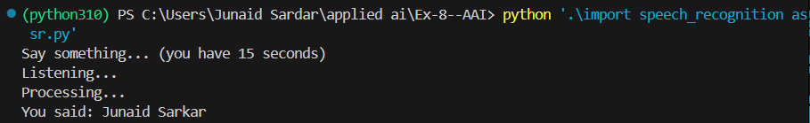

<H3>NAME: Junaid Sardar S</H3>
<H3>REGISTER NO. 212224100028</H3>
<H3>EX. NO.8</H3>
<H3>DATE: 9/11/25</H3>
<H1 ALIGN =CENTER>Implementation of Speech Recognition</H1>

## Aim:
 To implement the conversion of live speech to text.<BR>

## Algorithm:
Step 1: Import the speech_recognition library<Br>
Step 2: Initialize the Recognizer<Br>
Step 3: Create an instance of the Recognizer class, which will be used for recognizing speech.<Br>
Step 4: Set the duration for audio capture<Br>
Step 5: Define a variable to specify the duration (in seconds) for which the program will capture audio from the microphone.<Br>
Step 6: Display a message in the console to prompt the user to speak.<Br>
Step 7: Capture audio from the default microphone<Br>
Step 9: Use the default microphone as the audio source.<Br>
Step 10: Record audio for the specified duration using the Recognizer instance.<Br>
Step 11: Perform speech recognition with exceptional handling:<Br>
•	Attempt to recognize speech from the captured audio using the Google Speech Recognition service.<Br>
•	If successful, print the recognized text.<Br>
•	Handle specific exceptions: If the recognition result is unknown or if there is an issue with the request to the Google Speech Recognition service, print corresponding error messages.<Br>
•	A generic exception block captures any other unexpected errors.<Br>

## Program:
```
import speech_recognition as sr

r = sr.Recognizer()

print("Say something... (you have 15 seconds)")

try:
    with sr.Microphone() as source:
        r.adjust_for_ambient_noise(source)  
        print("Listening...")
        audio_data = r.listen(source)
        print("Processing...")
    
    text = r.recognize_google(audio_data,language="hi-IN")
    print("You said:", text)

except sr.WaitTimeoutError:
    print("No speech detected in given time.")
except sr.UnknownValueError:
    print("Sorry, could not understand the audio.")
except sr.RequestError as e:
    print(f"Error with the request to Google Speech Recognition service: {e}")
except Exception as e:
    print(f"Error: {e}")
```

## Output:


## Result:
Thus ,the program to perform the Implementation of Speech Recognition is executed sucessfully.